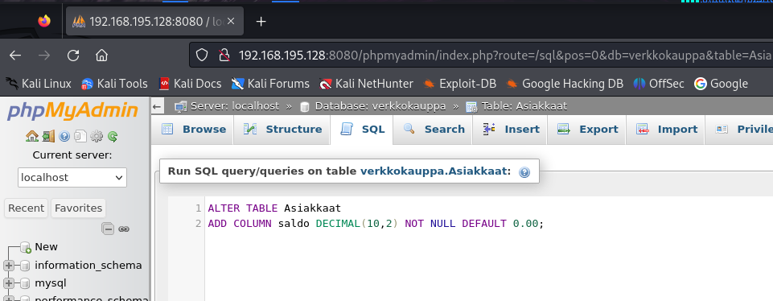
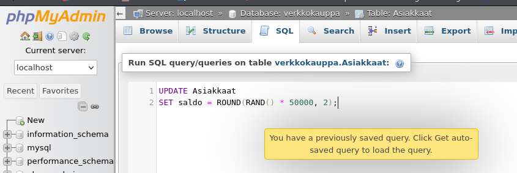
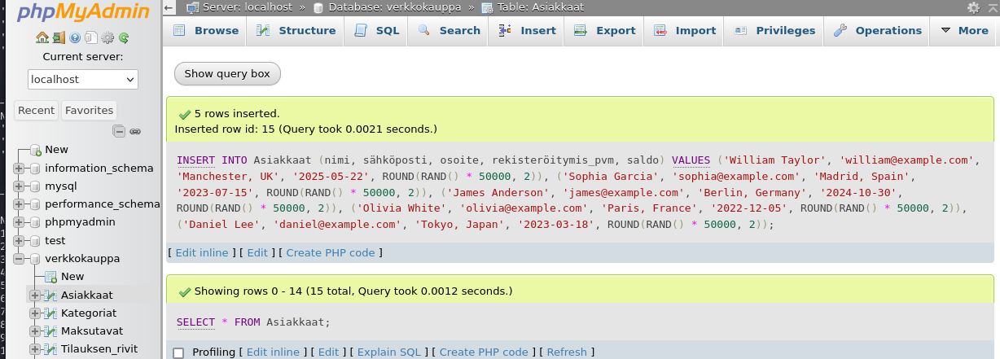
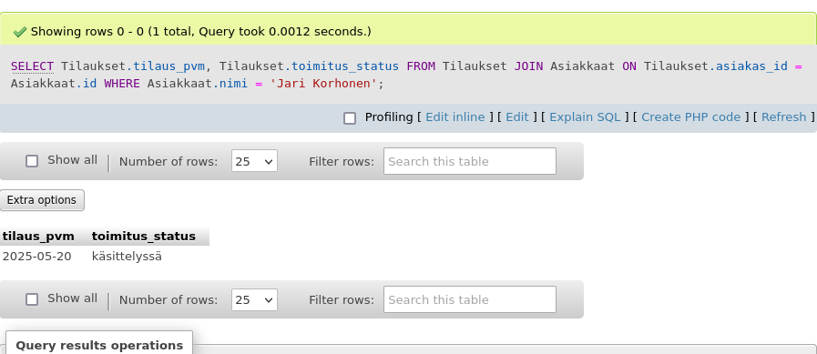
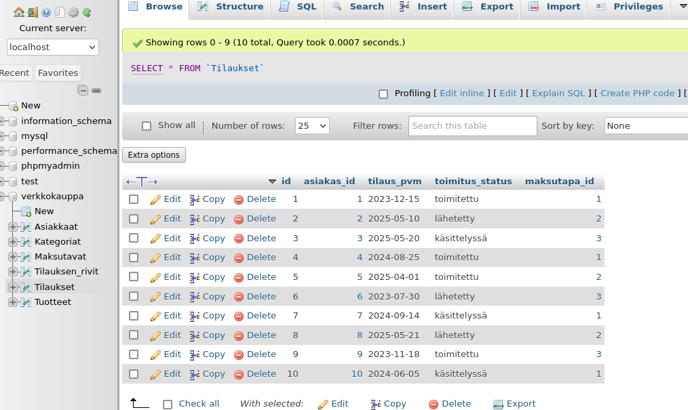

# Muutamia ja pientä harjoitusta


## Tulosta kaksi tai useampi taulukko
```
-- kaksi tai useampi taulukkoa tulostettuna
SELECT * FROM Maksutavat, Tuotteet, Asiakkaat
```


## Lisätään sarakketta lisää taulukkon alle ja annettaan satunnainen luku
```
-- ALTER TABLE, jotta saldo-sarake lisätään ilman tietojen menetystä - eli lisätään taulukkon alle yksi rivi lisää
ALTER TABLE Asiakkaat
ADD COLUMN saldo DECIMAL(10,2) NOT NULL DEFAULT 0.00;

--lisätyn "Saldo" sarakkeen jälkeen niin päivitettään saldo satunnaisesti ja saldo voi olla esim. rahansakin
UPDATE Asiakkaat
SET saldo = ROUND(RAND() * 50000, 2);
```








---

## Lisätään henkilöitä taulukkon alle
```
-- lisätään 5 uutta henkilöä "Asiakkaan" taulukkoon - käytettään "INSERT INTO" - KOMENTOA

INSERT INTO Asiakkaat (nimi, sähköposti, osoite, rekisteröitymis_pvm, saldo) VALUES 
('William Taylor', 'william@example.com', 'Manchester, UK', '2025-05-22', ROUND(RAND() * 50000, 2)),
('Sophia Garcia', 'sophia@example.com', 'Madrid, Spain', '2023-07-15', ROUND(RAND() * 50000, 2)),
('James Anderson', 'james@example.com', 'Berlin, Germany', '2024-10-30', ROUND(RAND() * 50000, 2)),
('Olivia White', 'olivia@example.com', 'Paris, France', '2022-12-05', ROUND(RAND() * 50000, 2)),
('Daniel Lee', 'daniel@example.com', 'Tokyo, Japan', '2023-03-18', ROUND(RAND() * 50000, 2));
```




```
-- 5 henkilöä lisää ja rekisteröiymis pv n. 2000 - 2025 väliltä
INSERT INTO Asiakkaat (nimi, sähköposti, osoite, rekisteröitymis_pvm, saldo) VALUES 
('Nathan Reed', 'nathan@example.com', 'Dallas, USA', DATE_SUB('2025-12-31', INTERVAL FLOOR(RAND() * 9490) DAY), ROUND(RAND() * 50000, 2)),
('Isabella Evans', 'isabella@example.com', 'Auckland, New Zealand', DATE_SUB('2025-12-31', INTERVAL FLOOR(RAND() * 9490) DAY), ROUND(RAND() * 50000, 2)),
('Ethan Hall', 'ethan@example.com', 'Toronto, Canada', DATE_SUB('2025-12-31', INTERVAL FLOOR(RAND() * 9490) DAY), ROUND(RAND() * 50000, 2)),
('Lily Adams', 'lily@example.com', 'Berlin, Germany', DATE_SUB('2025-12-31', INTERVAL FLOOR(RAND() * 9490) DAY), ROUND(RAND() * 50000, 2)),
('Jackson Murphy', 'jackson@example.com', 'Sydney, Australia', DATE_SUB('2025-12-31', INTERVAL FLOOR(RAND() * 9490) DAY), ROUND(RAND() * 50000, 2));
```


```
-- yksittäisen käyttäjän lisääminen ilman satunnaista lukua, et syöttää saldon itse
INSERT INTO Asiakkaat (nimi, sähköposti, osoite, rekisteröitymis_pvm, saldo) VALUES 
('Harry Shadows', 'harry@example.com', 'Newcastle, UK', '2005-07-13', 9999.00);
```


```
-- päivitystä rekisteröitymis_pvm _ satunnaisesti n. 1950 - 2010
-- aloituspiste on 2010-12-31 josta päivämääriä vähennettään randomisti 21915 päivää - vastaa n. 60 vuotta.
UPDATE Asiakkaat
SET rekisteröitymis_pvm = DATE_SUB('2010-12-31', INTERVAL FLOOR(RAND() * 21915) DAY);
```

```
-- saldoa n. alle 5 000
SELECT * FROM Asiakkaat WHERE floor(saldo) < 5000; 
```

---

# JOIN + WHERE

Näytä kaikki tilaukset, joissa asiakas on "Jari Korhonen", ja listaa tilauspäivämäärä ja tilauksen tila.
Tarvittaan `JOIN Asiakkaat` + `Tilaukset`





Pientä teoriaa, tietokannassa siis taulukkossa on "Tilaukset" , "Asiakkaat" erissä tiedoissa. 
- "Tilaukset" voi sisältyä eri tietoja kuten `tilaus_pvm` ja `toimitus_status`
- "Asiakkaat" sisältyy asiakkastietoja just mm. nimi, asiakas_id , jne.

Tässä (vastauksessa) on toistettu kaksi taulukkoa, kun haettaan/tarvitaan tiettyä "JOIN" jotta tiedot liittyvät toisiinsa
JOIN vähä kuin viittaa taulukko Asiakkaaseen, tämä ON tarkoittaa ehtoa vähä kuin A yhtä kuin B.
sitten WHERE haettaan Jari Korhonen nimeä. 

Sama pätee jos haluttaisiin useampi nimi sitten tulee sulkuun ja heittomerkit ketä me haluataan viitata ja sama pätee että halutaan nimettyä henkilöitä
WHERE Asiakkaat.nimi IN ('Jori Korhonen', 'Anna Virtanen', 'Matti Meikäläinen');


---

# JOIN + GROUP BY + SUM

Näytä kunkin asiakkaan nimi ja kuinka paljon he ovat käyttäneet rahaa yhteensä tilauksiinsa.

Tarvittaan JOINia vähintään 3 taulusta:
Asiakkaat → Tilaukset → Tilauksen_rivit

```
SELECT Asiakkaat.nimi, SUM(Tilauksen_rivit.hinta * Tilauksen_rivit.maara) AS kokonaiskulut
FROM Asiakkaat
JOIN Tilaukset ON Asiakkaat.id = Tilaukset.asiakas_id
JOIN Tilauksen_rivit ON Tilaukset.id = Tilauksen_rivit.tilaus_id
GROUP BY Asiakkaat.nimi;
```


Mini teoria;<br>
Lasketaan SUM(hinta * määrä), eli jokaisen asiakkaan kaikki tilausten rivit yhteenlaskettu summa.

JOIN:
Asiakkaat JOIN Tilaukset yhdistää asiakkaan ja hänen tilauksensa käyttämällä asiakas_id.
Tilaukset JOIN Tilauksen_rivit yhdistää tilaukset ja niiden yksittäiset rivit tilaus_id-sarakkeen kautta.


GROUP BY:
Ryhmittelee tulokset asiakkaan nimen perusteella, jotta jokainen asiakas saa oman rivinsä tuloksessa.

---

# JOIN + GROUP BY SUM
Tämä kuin aikaisempi harjoitus, mutta lisätty HAVING SUM(...) > 1000

Summa käyttäneet yli 1000e (saldoa)

```
SELECT Asiakkaat.nimi, SUM(Tilauksen_rivit.yhteishinta) AS saldo
FROM Asiakkaat
JOIN Tilaukset ON Asiakkaat.id = Tilaukset.asiakas_id
JOIN Tilauksen_rivit ON Tilaukset.id = Tilauksen_rivit.tilaus_id
GROUP BY Asiakkaat.nimi
HAVING SUM(Tilauksen_rivit.yhteishinta) > 1000;
```

Muutin alle 1000 (saldo) niin toi muutaman rivin tuloksensa, mutta hyvä check


Mini teoria; <br>
GROUP BY: ryhmittelee rivit esimerkiksi asiakkaan nimen mukaan

SUM(): laskee ryhmälle yhteissumman (tässä: paljonko kukin asiakas on käyttänyt rahaa)

HAVING: suodattaa ryhmiä aggregaattifunktion (SUM, AVG jne.) perusteella
(ei käytetä WHERE vaan HAVING aggregaattien kanssa!)

---

# CASE + JOIN

Näytä tilaukset, ja lisää sarake "tilaustyyppi", joka kertoo:

jos status on käsittelyssä → "Vireillä"

jos status on toimitettu → "Valmis"

muuten → "Matkalla"

Hyödynnettään CASE-lausetta.

```
SELECT 
    Asiakkaat.nimi,
    Tilaukset.tilaus_pvm,
    Tilaukset.toimitus_status,
    CASE
        WHEN Tilaukset.toimitus_status = 'käsittelyssä' THEN 'Vireillä'
        WHEN Tilaukset.toimitus_status = 'toimitettu' THEN 'Valmis'
        ELSE 'Matkalla'
    END AS tilaustyyppi
FROM Tilaukset
JOIN Asiakkaat ON Tilaukset.asiakas_id = Asiakkaat.id;
```

Mini teoria: <br>
JOIN: liitetään asiakkaan nimi tilaukseen

CASE: luodaan uusi sarake tilaustyyppi logiikan mukaisesti, ja ei tarvita sulkeita

AS: nimeää sarakkeen tuloksissa


---

# Alikysely (Subquery)
Näyttää asiakkaat, jotka eivät ole tehneet yhtään tilausta.

Tämä vaatii NOT IN (SELECT asiakas_id FROM Tilaukset)
tai vaihtoehtoisesti LEFT JOIN ja WHERE Tilaukset.id IS NULL


Eli asiakkaat jotka eivät ole tehneet yhtään tilausta. 
```
SELECT nimi
FROM Asiakkaat
WHERE id NOT IN (
    SELECT asiakas_id FROM Tilaukset
);
```

## Toinen vaihtoehto - LEFT JOIN + IS NULL
Kaikki asiakkaat haetaan mukaan (LEFT JOIN)

Jos asiakas ei ole tehnyt tilausta, Tilaukset.id jää tyhjäksi → IS NULL

```
SELECT Asiakkaat.nimi
FROM Asiakkaat
LEFT JOIN Tilaukset ON Asiakkaat.id = Tilaukset.asiakas_id
WHERE Tilaukset.id IS NULL;
```


